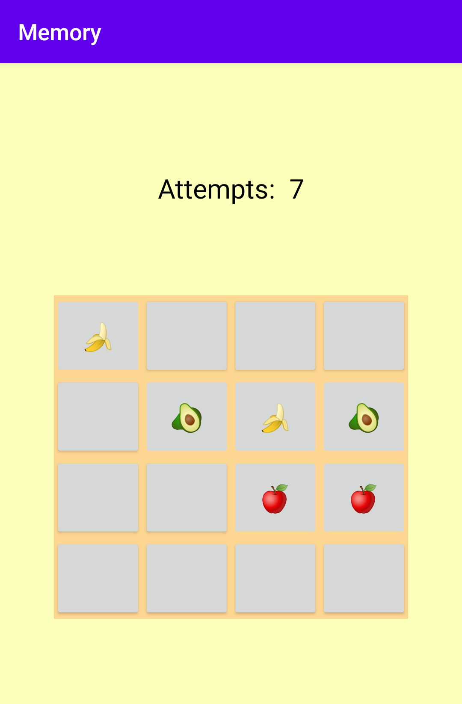

## Introduction

Memory is a mobile game inspired by the classical memory game in which a player is required to match pairs of cards with identical symbols. This is developed in 2 hours for the *Mobile Programming* practical exam at [@Unisa](https://unisa.it) using Java and Android.

## Programming languages and technologies

## License

Distributed under the MIT License. See `LICENSE` for more information.
